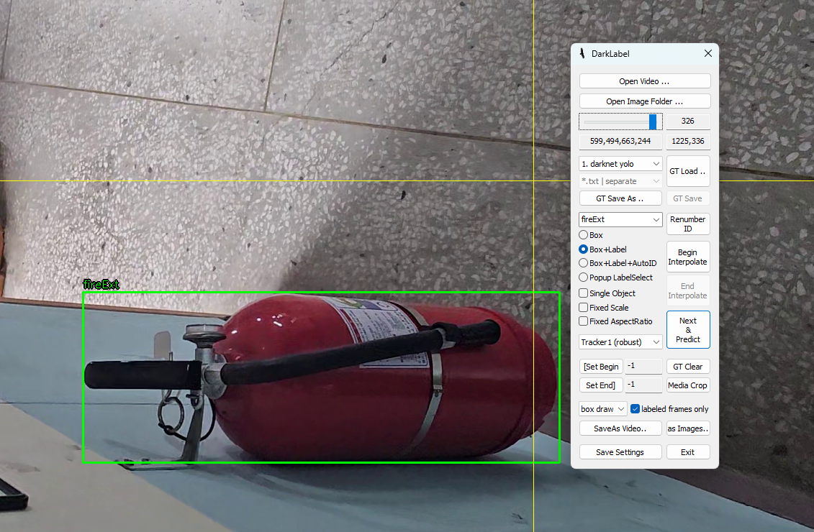
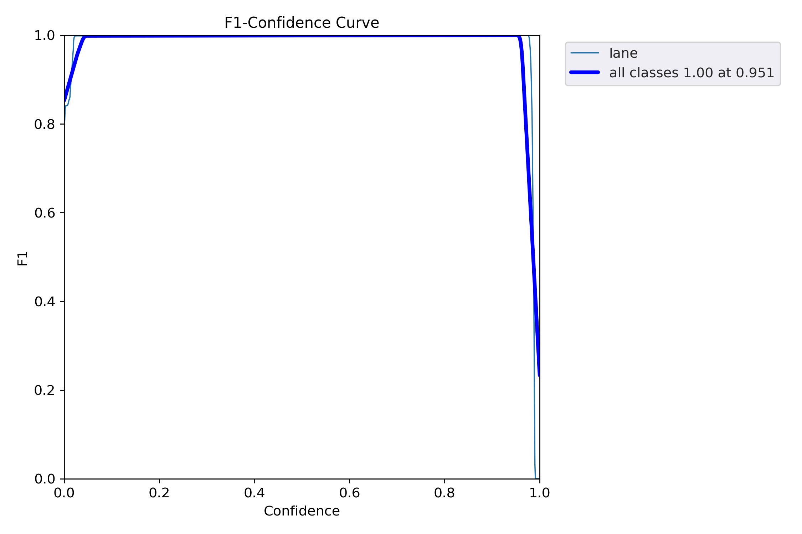
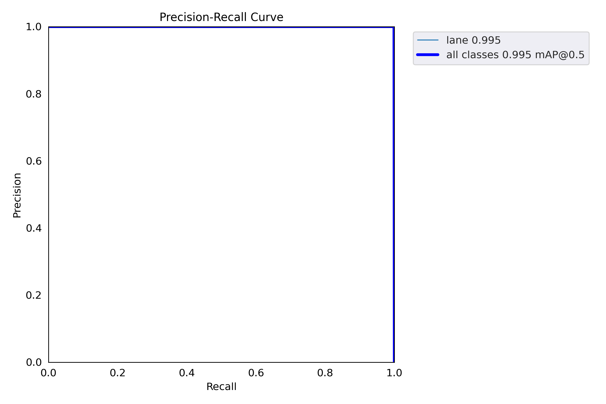
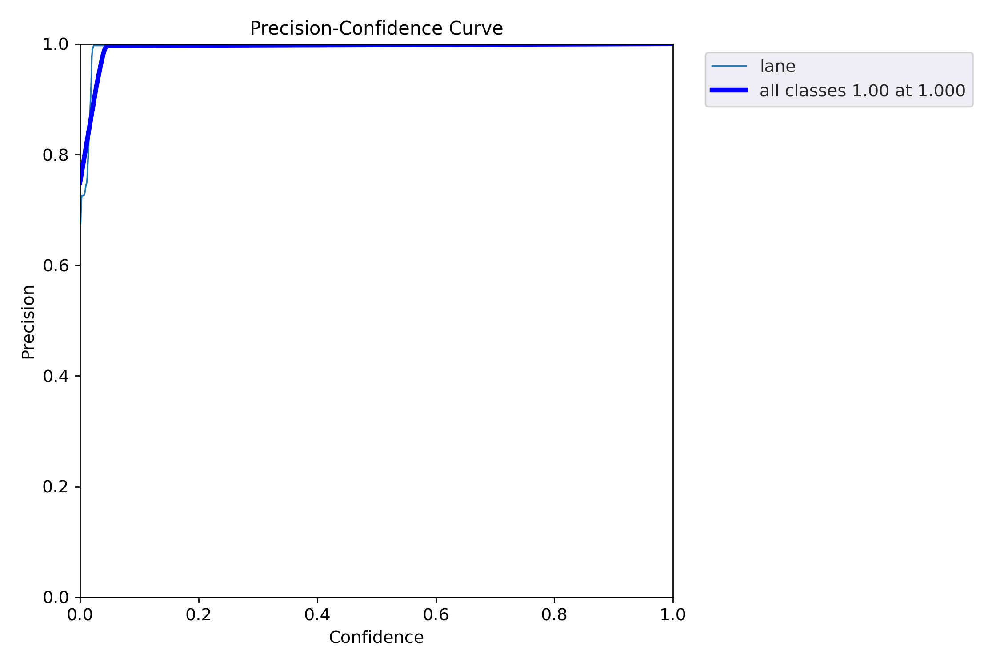
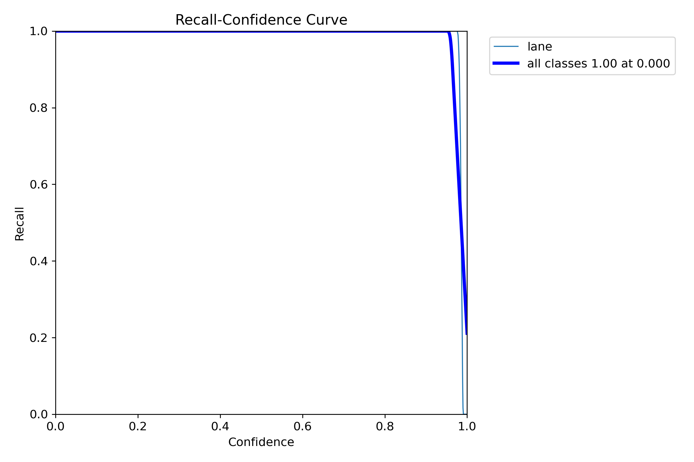
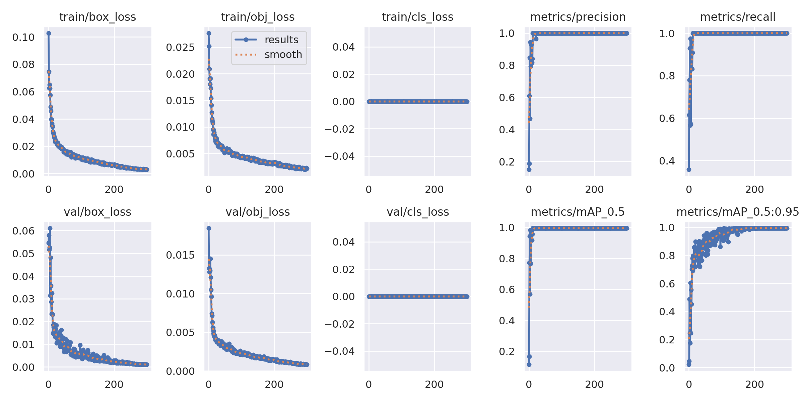

# :fire_extinguisher:머신러닝을 이용한 소화기 감지 모델

## :globe_with_meridians:프로젝트 개요 (Overview of the Project)

### :small_blue_diamond:배경 정보 소개 (Opening Background Information)

  - 화재 사고 발생 시 소화기를 빠르게 찾는 것은 초기 화재 진압의 핵심입니다. 하지만 실제 상황에서 소화기를 빠르게 식별하는 것은 쉽지 않은 경우가 많습니다. 이를 해결하기 위해 머신러닝을 활용한 소화기 감지 기술은 안전성과 효율성을 크게 높일 수 있는 잠재력을 가지고 있습니다. 예를 들어, 로봇이 소화기를 찾고, 주변 사람을 해당 위치로 유도하는 등의 방법을 통해 화재를 빠르게 진압할 수 있습니다.

### :small_blue_diamond:프로젝트의 전반적인 설명 (General Description of the Current Project)

  - 이 프로젝트는 소화기를 감지하는 딥러닝 모델을 개발하는 것을 목표로 한다. YOLOv5와 같은 실시간 객체 탐지 모델을 활용하여 다양한 환경에서 소화기를 정확히 탐지하고, 이를 기반으로 알림 시스템과 통합하여 화재 발생 시 신속하게 대응할 수 있는 솔루션을 제안한다. 또한, 소화기 감지 기능을 탑재한 로봇이 가정 내 화재 발생 시 소화기 위치를 파악하고 사람에게 알려주는 시스템을 제시하여 화재 초기에 신속한 대응이 가능하도록 한다.

### :small_blue_diamond:제안하고 싶은 프로젝트의 강점 (Proposed Idea for Enhancements to the Project)

  1. **실시간 감지**: YOLOv5를 활용해 소화기를 실시간으로 감지하여 즉각적인 대응 가능.
  2. **여러 각도에서의 촬영**: 초기 모델 학습 시, 비슷한 구도에서만 촬영된 영상으로는 정확도가 낮았으며, 다양한 각도에서 촬영한 데이터를 활용하여 정확도를 크게 향상시켰다.
  3. **화재 진압 기능이 없는 로봇에도 적용 가능**: 소화기 감지 로봇을 화재 진압 기능이 없는 가정용 로봇에 탑재하여, 화재 발생 시 소화기 위치를 빠르게 찾고, 사람에게 알려주거나 해당 위치로 유도할 수 있다.

### :small_blue_diamond:프로젝트의 가치와 중요성 (Value and Significance of this Project)

  - 소화기 탐지 시스템은 화재 안전 관리에서 중요한 역할을 한다. 이 프로젝트는 화재 발생 시 초기 대응 시간을 줄이고, 화재 피해를 최소화할 수 있는 잠재력을 제공한다. 공공시설, 산업 현장 등 다양한 공간에서 활용 가능하며, 스마트 안전 시스템의 필수 요소로 자리잡을 수 있다. 특히 가정용 로봇에 소화기 탐지 기능을 탑재함으로써, 화재 발생 초기 대응에 대한 안전성을 더욱 강화할 수 있다.

### :small_blue_diamond:직면하고 있는 한계 (Current Limitations)

  1. 다양한 환경에서 소화기를 탐지하는 데 있어 배경과 소화기의 색상, 형태가 유사한 경우 혼동이 발생할 수 있다.
  2. 실시간 감지 속도와 모델의 정확성 간 밸런스 설정이 중요하다.

### :small_blue_diamond:문헌 고찰 (Literature Review)

  - 소화기 탐지를 위한 객체 탐지 기술과 관련된 기존 연구를 조사하였다. 특히, YOLO 시리즈의 성능과 데이터셋 구성 방식, 그리고 다양한 환경에서의 모델 성능을 향상시키는 방법에 대한 연구를 참고하여 프로젝트 설계를 진행하였다.

---

## :memo:학습 과정

### :small_orange_diamond:영상 취득 방법 (Image Acquisition Method)

  - **실제 환경 데이터 수집**: 다양한 건물 내부에서 소화기를 촬영하여 실제 데이터를 확보하였다.

     

### :small_orange_diamond:학습 데이터 추출과 학습 어노테이션 (Learning Data Extraction and Learning Annotation):

  - 촬영된 영상을 프레임 단위 이미지로 만들거나 어노테이션을 하기 위해서 Video/Image Labeling and Annotation Tool로 잘 알려진 [DarkLabel](DarkLabel2.4)을 사용했다.

  1. **[DarkLabel.exe](DarkLabel2.4/DarkLabel.exe) 설치한다.**

  2. **[darklabel.yml](DarkLabel2.4/darklabel.yml) 파일을 수정한다.**

      2-1. 15번 줄에 `"my_classes2: ["fireExt"]"`을 추가한다.

      2-2. 66번 줄을 `classes_set: "my_classes2"`으로 수정한다.

  3. **DarkLabel 프로그램을 실행한다.**

  4. **학습에 사용할 영상을 `Open Video`을 통해 가져온다.**

     

  5. **위와 같이 설정하고 학습에 필요한 객체를 Box로 표시한다.**

      5-1. `shift + 우클릭`: 박스 삭제

      5-2. `shift + 좌클릭`: 박스 이동

      5-3. `space bar`: 다음 프레임으로 이동

  6. **모든 프레임에 라벨링을 한 후, 각 데이터 파일을 다운 받는다.**

      6-1. `as Images..`: 각 프레임 이미지 저장[(.jpg)](train/images)
     
      6-2. `GT Save As..`: 각 프레임 라벨 값 저장[(.txt)](train/labels)

     
        [원본 영상.avi](train/videos/20241115_175106_gt.avi)

### :small_orange_diamond:Nvidia Jetson Nano 학습 과정

  - 구글 코랩을 이용하여 학습하였다.
    
  - 상세 과정은 [여기](yolov5_ai_specialist.ipynb)에서 확인할 수 있다.

### :small_orange_diamond:Nvidia Jetson Nano 학습 결과

  - 학습 결과는 `/content/drive/MyDrive/yolov5/runs/train` [이 곳](runs/train)에 저장된다.

| **F1 Curve** | **PR Curve** |
|--------------|--------------|
|  |  |

| **P Curve**  | **R Curve**  |
|--------------|--------------|
|    |    |

| **Results**  |
|--------------|
|    |

### :small_orange_diamond:Nvidia Jetson Nano 학습 결과 검증 영상

     
        [원본 영상.mp4](runs/detect/exp6/20241115_112352.mp4)
